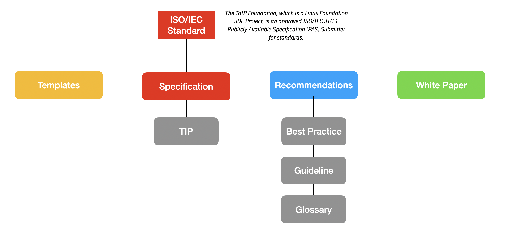

The ToIP Foundation aims to produce several publicly accessible artifacts. Each working group within the Foundation will determine the type and quantity of work products to be produced.

## Templates
To help the community quickly leverage lessons learned by others that have   established digital trust solutions, the Foundation will produce reusable documents that provide proven patterns that can be used to bootstrap new activities in a consistent manner.

## Specifications
A specification, in the context of ToIP, refers to a set of documents that  state explicitly or in detail the requirements to be satisfied by a design. Often a specification may mature into a technical standard. All standards are specifications but not all specifications are standards.

### TIP
A ToIP Interoperability Profile (TIP) represents a specific combination of technologies that span each layer of the ToIP Technical Stack. TIPs can be designed, refined and supported by interoperable vendors. A TIP will often be applicable to specific design principles and use cases. [Click here for more details](https://wiki.trustoverip.org/display/HOME/Workflow+Concepts).

## Recommendations
The ToIP Foundation, as authoritative body, can publicly suggest or propose  a best course of action referred to as a recommendation. There are three (3) recommendation types: Best Practices, Guidelines and Glossaries.

### Best Practice
A best practice is a technique or methodology that, through experience and research, has proven to reliably lead to a desired result. A commitment to using the best practices in any field is a commitment to using all the knowledge and technology at one's disposal to ensure success. Unlike standards that are long on the making, a best practice can be used to maintain quality and can be based on self-assessment or benchmarking.
Best practices are important for processes that you need to work correctly. They are simply the best way to do things and have been worked out through trial and error, and are found to be the most sensible way to proceed.

### Guideline
A guideline is a statement by which to determine a course of action. A guideline aims to streamline particular processes according to a set routine or sound practice.

### Glossary
A glossary, also known as a vocabulary or clavis, is an alphabetical list of terms in a particular domain of knowledge with the definitions for those terms.

## White Papers
A white paper is a public access authoritative report or guide that informs readers concisely about a complex issue and presents the issuing body's philosophy on the matter. It is meant to help readers understand an issue, solve a problem, or make a decision.
