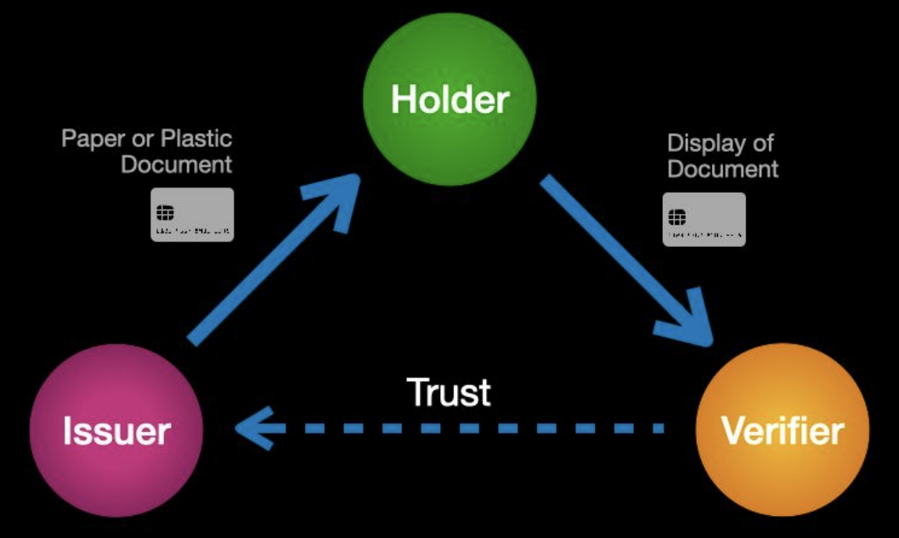

The reason credentials have evolved as a universal mechanism for establishing real-world trust is the fundamental “trust triangle” illustrated below.

No matter what type of credential, the triangle involves the same three primary roles:

1. **Issuers** are the source of credentials—every credential has an issuer. Most are organizations such as government agencies (passports), financial institutions (credit cards), universities (degrees), corporations (employment IDs), churches
(awards), etc. However individuals can also be issuers.
2. **Holders** request credentials from issuers, hold them in their wallets or filing cabinets, and present them when requested by verifiers (and approved by the holder). Although we most commonly think of individuals as holders, holders can
also be organizations, or even things (such as the registration for a car).
3. **Verifiers** can be anyone seeking trust assurance of some kind about the holder of a credential. Verifiers request the credentials they need and then follow their own policy to verify their authenticity and validity. For example, a TSA agent at an airport will look for specific features of a passport or driver’s license to see if it is valid, then check to ensure it is not expired.
